

I am **Endong Dai**, a Master's student in **Electrical and Computer Engineering (Hardware Track)** at **Duke University**. I focus on **RTL design, FPGA systems, and digital IC development,** with experience in **Verilog, C/C++, PLECS, and MATLAB simulation** . Strong foundation in power electronics and embedded system, backed by research in AI chip design and floating-point ALU implementation. Passionate about creating efficient, high-performance hardware architectures bridging digital logic and system integration. You can find more information through my [CV](https://github.com/endong-dai/endong-dai.github.io/blob/main/docs/CV.pdf).

Interested in:

- ASIC RTL Design  
- Hardware Accelerators for AI  
- FPGA RTL Design  

---

# 🎓 Education

**Duke University** — Durham, NC, US
M.S. Electrical and Computer Engineering (Hardware Track)  
Aug 2025 – Present  

**University of Nottingham** (China + UK 2+2 Program)  
B.Eng. Electrical and Electronic Engineering — **First Class Honours**  
Sep 2021 – Jul 2025  

**Awards**  
- Dean’s Scholarship  

---

# 🔧 Hardware Skills

### Digital Design
- Verilog/SystemVerilog
- ASIC/FPGA Development (Quartus, Vivado)

### Tools
- Cadence Virtuoso (Digital & Analog IC Layout)
- Altium Designer & KiCad PCB Design
- LTspice
- PLECS
- MATLAB / Simulink

### Embedded Systems
- C / C++
- MIPS / PIC16 Assembly
- Arduino
- Raspberry Pi
- STM32

### Platforms
- Linux (Ubuntu)
- ROS

---

# 💻 Selected Projects

---

## Diffusion AI Chip Tape-Out PCB (CPGA Socket Design)

**Duke University**  
Mar 2026 – Present (v1 completed Apr 2026)

Designed a 6-layer PCB socket system for a **164-pin diffusion AI chip** using a **CPGA-180 package**, enabling high-speed communication with dual USB FX3 boards and external debugging interfaces. Focused on **signal integrity, delay budgeting, and power domain partitioning** across chip-package-board co-design.

### PCB Schematic & Layout

| Schematic | Layout |
|--------------|------------|
| 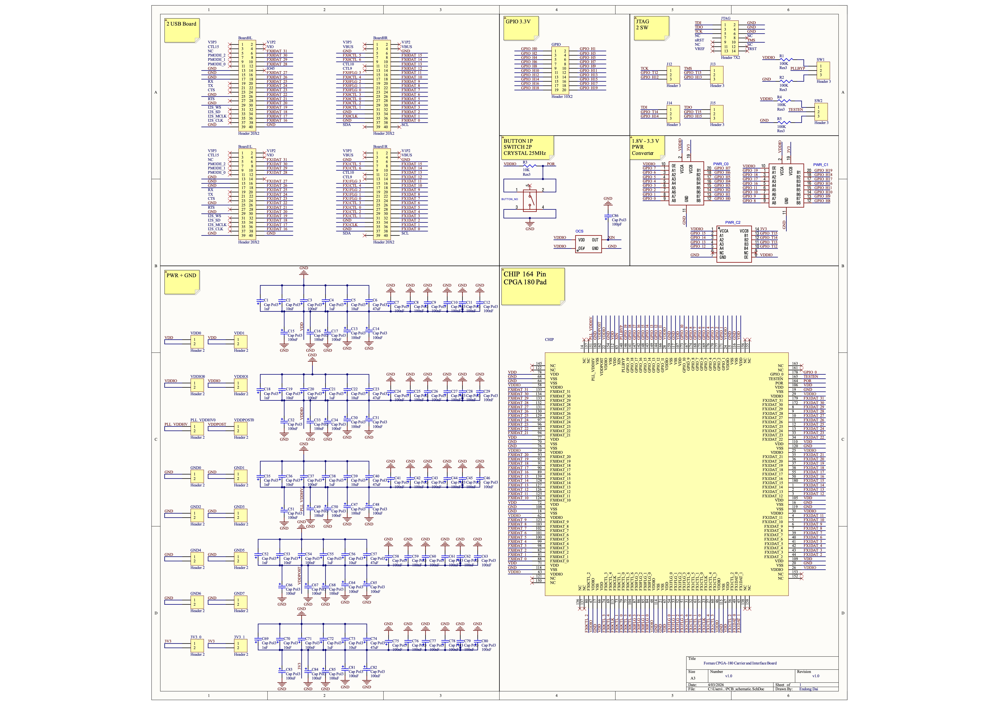 | 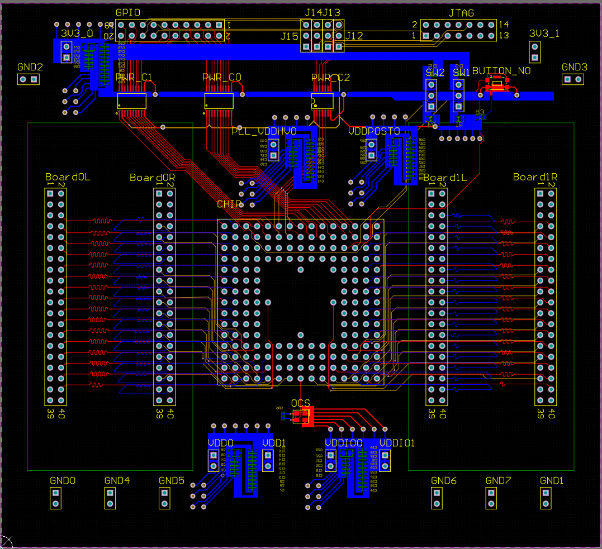 |

### Key Contributions

- Designed **CPGA-180 socket mapping and chip-to-board bonding interface** for a 164-pin custom ASIC
- Implemented **dual 32-bit high-speed interfaces (100 MHz)** to USB FX3 boards with strict timing constraints
- Achieved **length-matched routing (1800 mil ± 1 mil)** to ensure signal skew minimization
- Performed **end-to-end delay budgeting**: PCB delay (0.3ns) + USB interface (0.7ns) + Chip Package delay = **2.5 ~ 3 ns system requirement**
- Partitioned **multiple power domains (VDDIO / VDD_core / VDDHV / VDDPOST)** and designed stable power distribution network
- Completed **full schematic + BOM (JLCPCB components)** and **6-layer PCB layout** in Altium Designer

---

## Diffusion AI Chip – Gather/Scatter Unit (SGU)

**Duke University**  
Sep 2025 – Jan 2026  

Designed a Gather/Scatter Unit for irregular memory access in diffusion AI accelerators with **AXI** interface.

### Gather / Scatter Dataflow

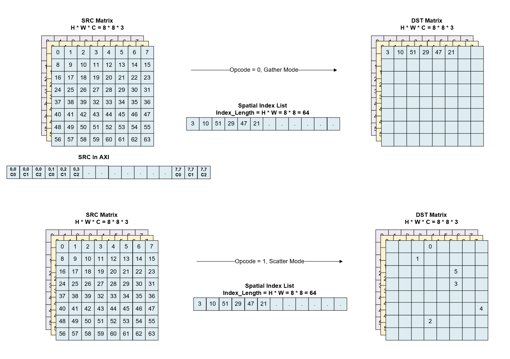

This diagram illustrates how the SGU performs gather and scatter operations using a spatial index list.

### SGU Hardware Architecture (4-stage pipeline)

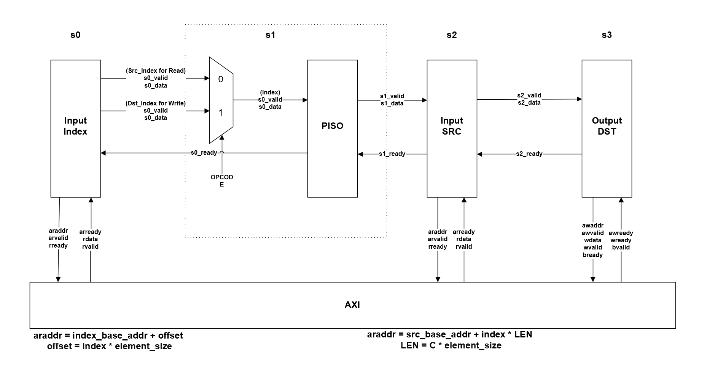

---

## IEEE-754 Half Precision Floating-Point ALU

**Duke University**  
Sep 2025 – Dec 2025  

Designed a **16-bit floating-point ALU** supporting: ADD, SUB, MUL, DIV (Restoring Method)

Estimated performance (TSMC 65 nm):

- 16 MHz Maximum Frequency  
- <18 mW Power Consumption 
- 0.0083 mm² Divider Core Area

### Divider Core Top-Level Schematic

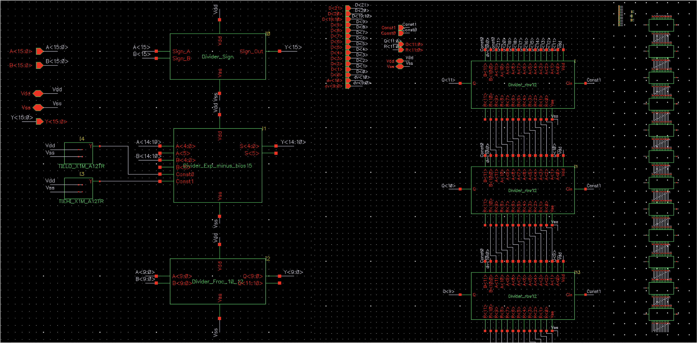

Top-level hierarchical schematic of the divider core showing sign processing, exponent logic, and fraction division datapath.

### Divider Core Layout

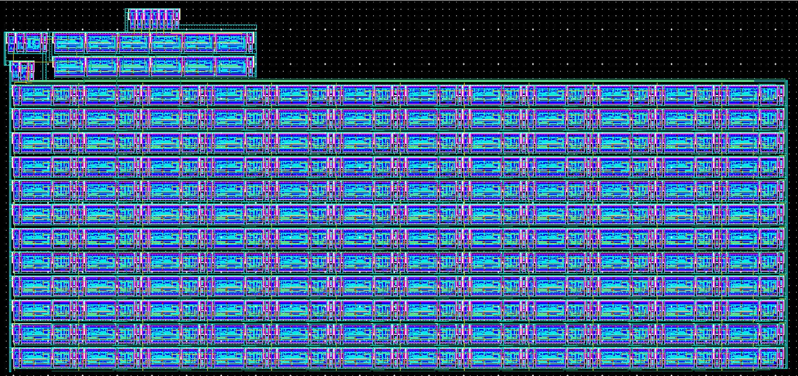

Standard-cell physical layout of the divider core implemented in a digital CMOS flow.

---

## High-Frequency Power Electronics Converter

**University of Nottingham**  
Final Year Individual Project  
Oct 2024 – May 2025  

Designed a high-frequency power conversion system for **Electric Vehicle Onboard Chargers** using wide-bandgap devices.

Key features:

- **Totem-Pole PFC stage** for high power factor and low THD
- **CLLC resonant DC–DC converter** for high efficiency
- Dual-loop PI + PR control strategy
- Efficiency and thermal performance evaluation under multiple load conditions

### System Architecture

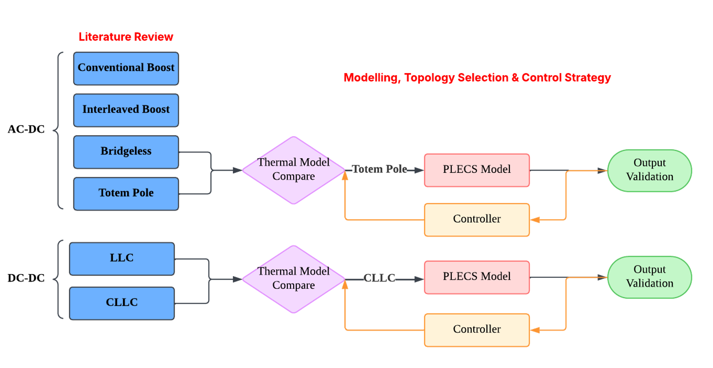

Two-stage architecture consisting of a Totem-Pole PFC front-end and a CLLC resonant DC–DC converter.

### PFC Stage

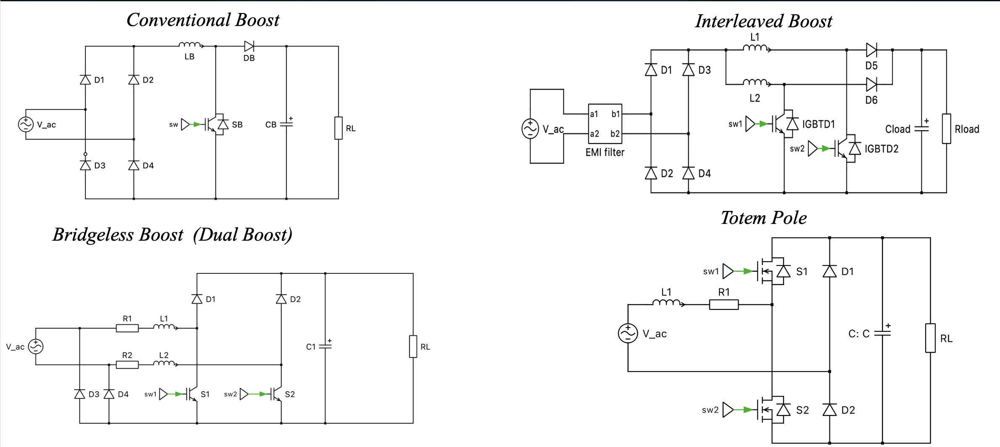

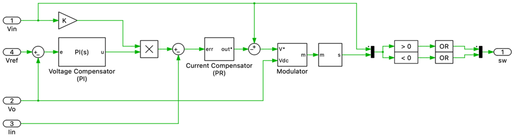

### DC-DC Converter Stage

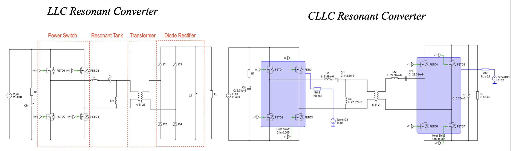

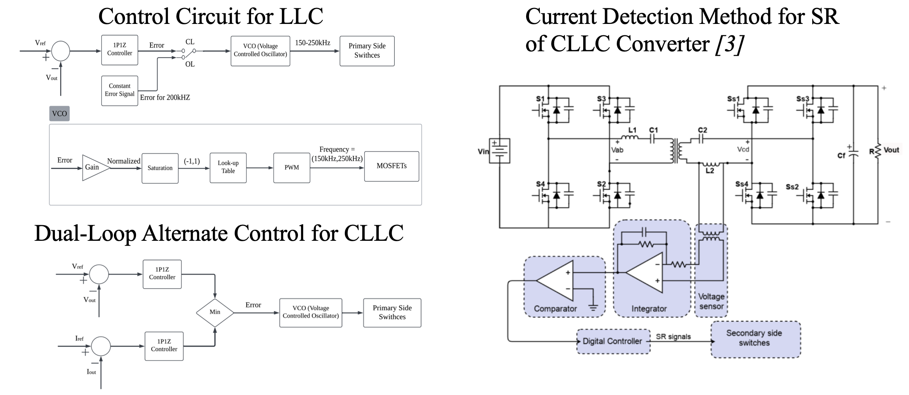

---

## Omni-Directional Robot Collision Awareness

**University of Nottingham**  
Jun 2024 – Aug 2024  

Implemented an autonomous robot navigation system using **ROS and LiDAR-based SLAM**.

Key work:

- Configured **ROS Noetic + Gazebo + RViz** simulation environment
- Deployed **Cartographer SLAM** for real-time LiDAR mapping
- Integrated **RoboRTS navigation stack** for autonomous navigation
- Implemented **2D mapping and navigation** using LiDAR sensor data

### LiDAR Mapping Result (IAMET Building)

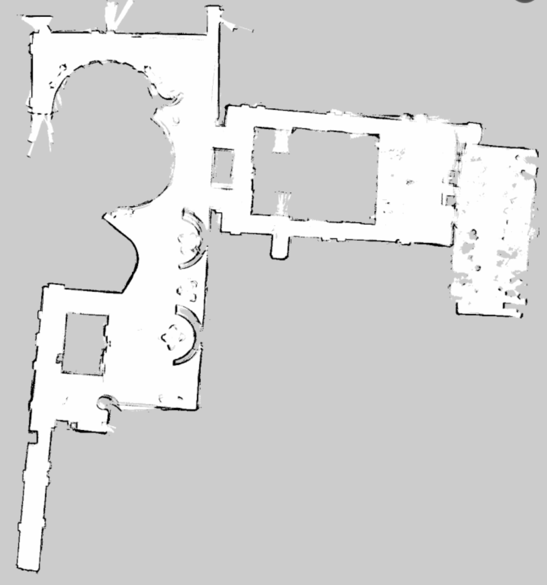

Final map generated by the Cartographer SLAM algorithm, reconstructing the layout of the second floor of the IAMET building using LiDAR data.

---

## Heart Rate, Pulse Oximeter System

**University of Nottingham**  
Oct 2023 – Dec 2023  

Embedded biomedical device using **STM32**.

- Designed analog front-end circuits
- Implemented **FFT-based heart rate detection**
- Developed ADC firmware for signal processing

---

# 📬 Contact

Email  
ed253@duke.edu  
daiendong81@gmail.com  

GitHub  
https://github.com/endong-dai  

LinkedIn  
https://www.linkedin.com/in/endong-dai-607052385
