

I am **Endong Dai**, a Master's student in **Electrical and Computer Engineering (Hardware Track)** at **Duke University**. I focus on **Digital IC RTL design, VLSI Layout Design and PCB development,** with experience in **Verilog, C/C++, Altium Designer, and Virtuoso** . Strong foundation in power electronics and embedded system, backed by research in AI chip design and floating-point ALU implementation. Passionate about creating efficient, high-performance hardware architectures bridging digital logic and system integration. You can find more information through my [CV](https://github.com/endong-dai/endong-dai.github.io/blob/main/docs/CV.pdf).

Interested in:

- ASIC/FPGA RTL Design  
- VLSI Layout
- PCB

---

# 🎓 Education

**Duke University** — Durham, NC, US
M.S. Electrical and Computer Engineering (Hardware Track)  
Aug 2025 – Present  

**University of Nottingham** (China + UK 2+2 Program)  
B.Eng. Electrical and Electronic Engineering — **First Class Honours**  
Sep 2021 – Jul 2025  

**Awards**  
- Dean’s Scholarship  

---

# 👨‍🏫 Teaching

## Teaching Assistant — Duke University

**Department of Electrical & Computer Engineering**  
Summer – Fall 2026  

- Led an **RTL Design Workshop** (Summer 2026), guiding students through Verilog modeling and simulation.
- Course **TA for ECE 550 — Fundamentals of Computer Systems and Engineering** (Fall 2026): held office hours, graded assignments, and mentored students on RTL design and verification.

---

# 🔧 Hardware Skills

### IC & FPGA Design
- Verilog / SystemVerilog (RTL Design & Verification)
- FPGA Prototyping & Bring-Up (Xilinx ZCU102)
- Vivado, Quartus Prime, ModelSim
- Cadence Virtuoso (Digital & Analog/Mixed-Signal IC Layout)

### PCB & Simulation
- Altium Designer & KiCad PCB Design
- LTspice
- PLECS
- MATLAB / Simulink
- Soldering

### Programming & Embedded
- C / C++
- Assembly (PIC16, MIPS)
- STM32 (STM32CubeIDE)
- Arduino
- Raspberry Pi
- ROS

### Tools & Platforms
- Claude Code
- Linux (Ubuntu)
- Git

---

# 💻 Selected Projects

---

<h2 class="project-title">LLM Accelerator – Matrix Multiplication Unit (MMU)</h2>

**Duke University - Duke Center of Computational Evolutionary Intelligence (CEI)**  
Jan 2026 – Jun 2026  

Architected the **Matrix Multiplication Unit (MMU)**, the central **GEMM/GEMV** engine of an LLM accelerator. The key idea is to use **K-means codebook (vector) quantization** to recast the memory-bound decode **GEMV** into a dense **GEMM**, achieving up to a **10× decode speedup** while keeping a single shared PE array for both prefill and decode.

### Core Idea — Codebook Quantization (GEMV → GEMM)

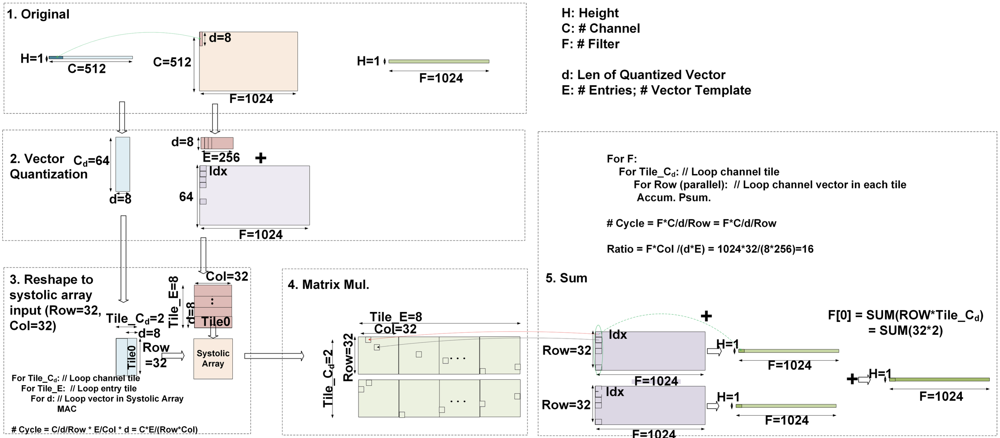

- **Original GEMV is memory-bound**: every decode step streams the full weight matrix (e.g. `C=512`, `F=1024`) from memory, so bandwidth — not compute — limits throughput.
- **Vector quantization**: weight vectors are clustered with **K-means** into a small codebook (`d=8` length vectors, `E=256` entries). Each weight is replaced by an **index (Idx)** into the codebook, drastically shrinking the weight footprint.
- **Reshape to systolic input**: indexed weights are tiled into the systolic array layout (`Row=32`, `Tile_C=32`), turning sparse/irregular lookups into a regular dense tile stream.
- **Matrix multiply + accumulate**: the codebook entries are matrix-multiplied once and reused across rows, so the heavy compute happens on the small codebook instead of the full weight matrix.
- **Result**: the effective work drops to `Ratio = F×Col + d×E = 1024×32 + 8×256 ≈ 16×` fewer operations, delivering the ~10× end-to-end decode speedup.

### Hardware Architecture & Dataflow

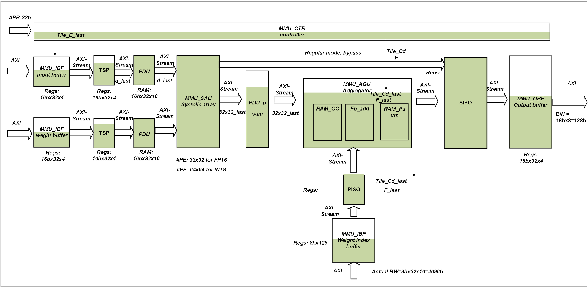

- **Dual-mode datapath on a shared PE array**, sequenced by the `MMU_CTR` controller:
  - **Prefill (regular mode):** full-precision GEMM — the quantization path is bypassed.
  - **Decode (quantized mode):** codebook-indexed GEMV computed as dense GEMM for optimized throughput.
- **Systolic PE array (`MMU_SAU`):** **32×32 PEs for FP16** and **64×64 PEs for INT8**, fed by an **AXI-Stream** ready/valid dataflow for back-pressure–safe streaming.
- **Front-end staging:** dual `MMU_IBF` input/weight buffers → `TSP` (transpose/skew) → `PDU` (phase delay unit) align operands into the row-skewed format the systolic array expects.
- **Back-end aggregation (`MMU_AGU`):** `RAM_OC`, `Fp_add`, and `RAM_Psum` accumulate partial sums (Psum), with **SIPO/PISO** converters bridging serial and parallel AXI-Stream widths.
- **Weight index path:** a dedicated `MMU_IBF` weight-index buffer (actual `BW = 8b × 32 × 16 = 4096b`) supplies codebook indices for the quantized decode mode.
- **Throughput & verification:** delivers **~1.0 TOPS** (INT8), verified against software golden models and synthesized in a **TSMC 16 nm** flow.

---

<h2 class="project-title">Diffusion Chip – FPGA Validation & Post-Silicon SoC Bring-Up</h2>

**Duke University - Duke Center of Computational Evolutionary Intelligence (CEI)**  
Aug 2025 – Jun 2026  

Drove **backend productization and bring-up** of the diffusion chip (**TSMC 16 nm, CPGA-208**): CPU/NPU, **1 MB GLB SRAM**, GPIO, and **dual 32-bit FX3 interfaces** over a shared **AXI fabric** (INT8 **1.024 TOPS**, FP16 **0.256 TOPS**).

### FPGA Validation & Post-Silicon Bench

| FPGA Pre-Silicon Validation (AMD ZCU102) | Post-Silicon SoC Bring-Up (Taped-Out Chip) |
|:---:|:---:|
| 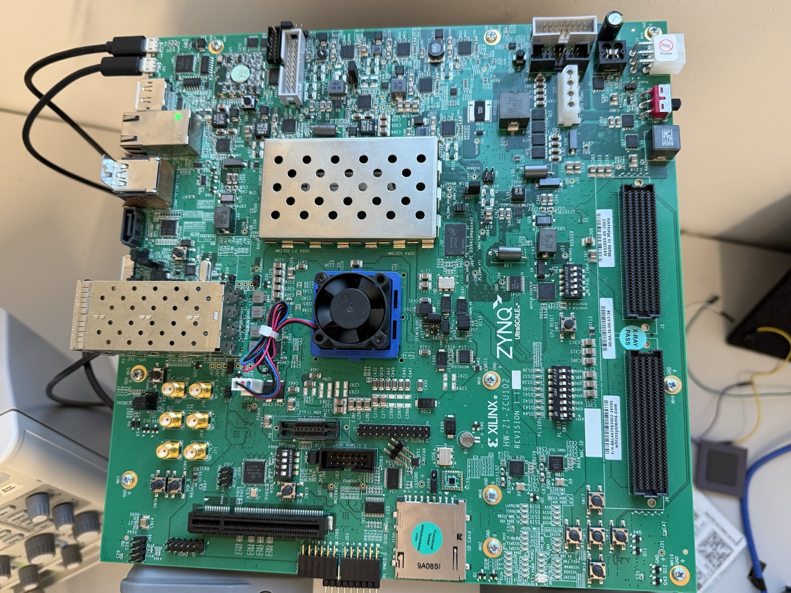 | 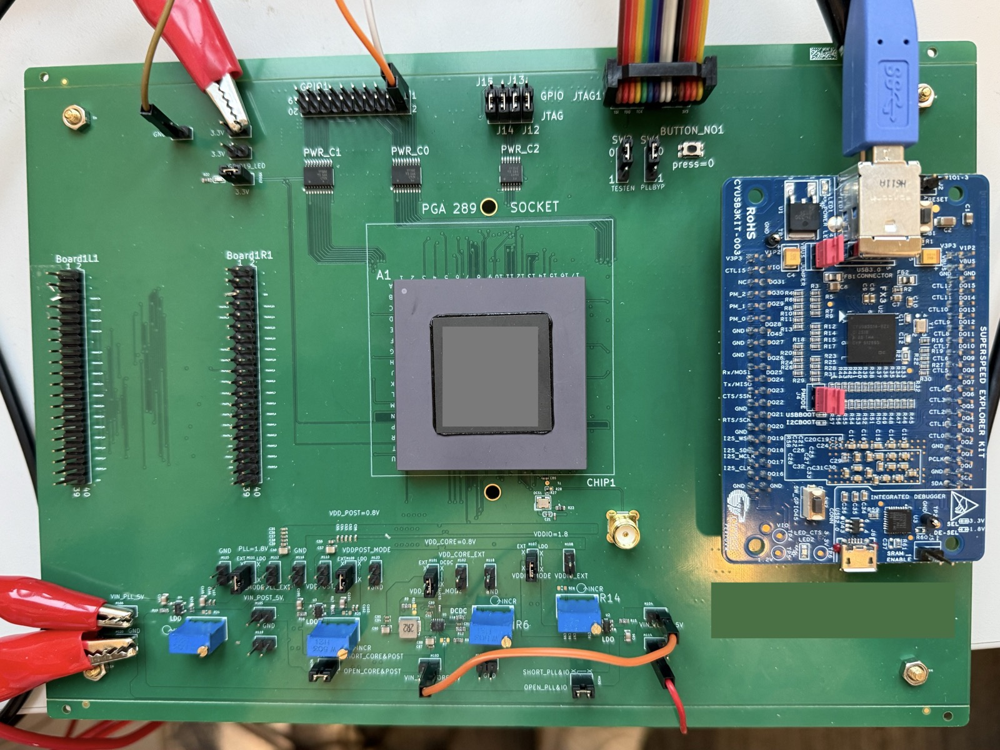 |

### Model-to-Silicon Verification Flow

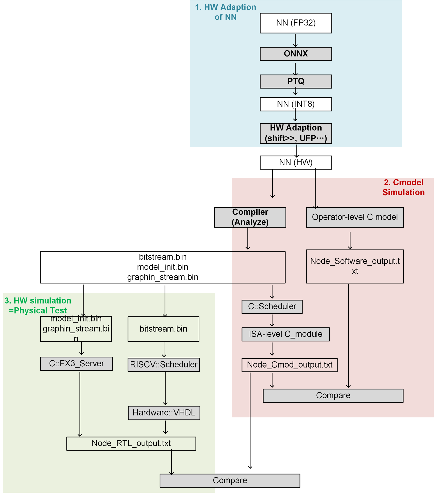

The diffusion NN is quantized (**ONNX → PTQ → INT8**) and hardware-adapted, then verified **node-by-node** across three paths — the **operator-level C-model (software golden)**, the **ISA-level C-model scheduler**, and the **hardware / physical run** (FX3 server + RISC-V scheduler + RTL) — comparing every node tensor to localize any mismatch. This is the flow used to drive the full diffusion UNet — **all 762 hardware-scheduled nodes** — to **bit-exact 0-mismatch** on real silicon.

### Key Contributions

- Deployed **FPGA-based validation on AMD ZCU102** to verify PC-to-chip communication and control functionality through **FX3, UART, JTAG, and GPIO** interfaces during system bring-up.
- Performed **post-silicon SoC validation** on the taped-out chip, bringing up **FX3 high-speed TX/RX links** and running **NPU and general-purpose operators** on real silicon against software golden models.
- Brought up the **full diffusion UNet** on real silicon — **all 762 hardware-scheduled nodes** of an 839-node ONNX graph — reaching **bit-exact 0-mismatch** against the scheduler / C-model golden across **41K+ dumped node tensors**.
- Root-caused and fixed **12 independent bring-up bugs** across firmware operator scheduling, NPU hardware modes, and FX3 USB packet/ACK protocol, advancing the on-chip run from node **n9 → full-model completion (n762)**.

---

Matrix Skew Unit for Systolic Dataflow (PDU) ▸ click to expand

**Duke University - Duke Center of Computational Evolutionary Intelligence (CEI)**  
Sep 2025 – Jan 2026  

Designed a phase delay unit (PDU) for matrix data alignment, enabling row-wise skewed dataflow for systolic-style matrix computation.

### PDU Dataflow

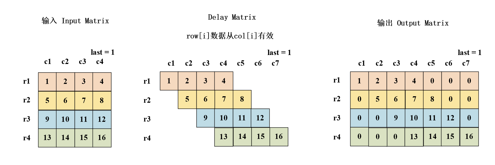

### PDU Pipeline

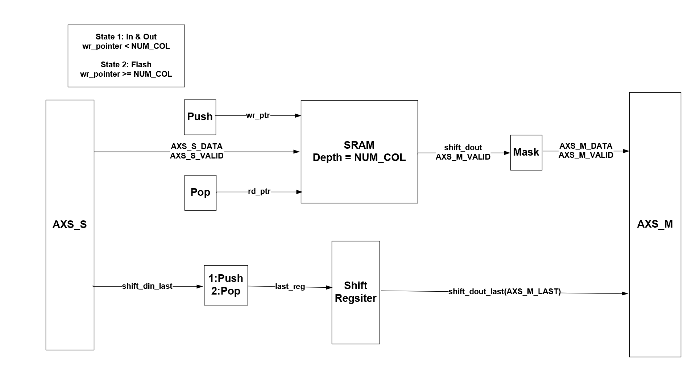

---

Diffusion AI Chip – Gather/Scatter Unit (SGU) ▸ click to expand

**Duke University - CEI**  
Sep 2025 – Jan 2026  

Designed a Gather/Scatter Unit for irregular memory access in diffusion AI accelerators with **AXI** interface.

### Gather / Scatter Dataflow

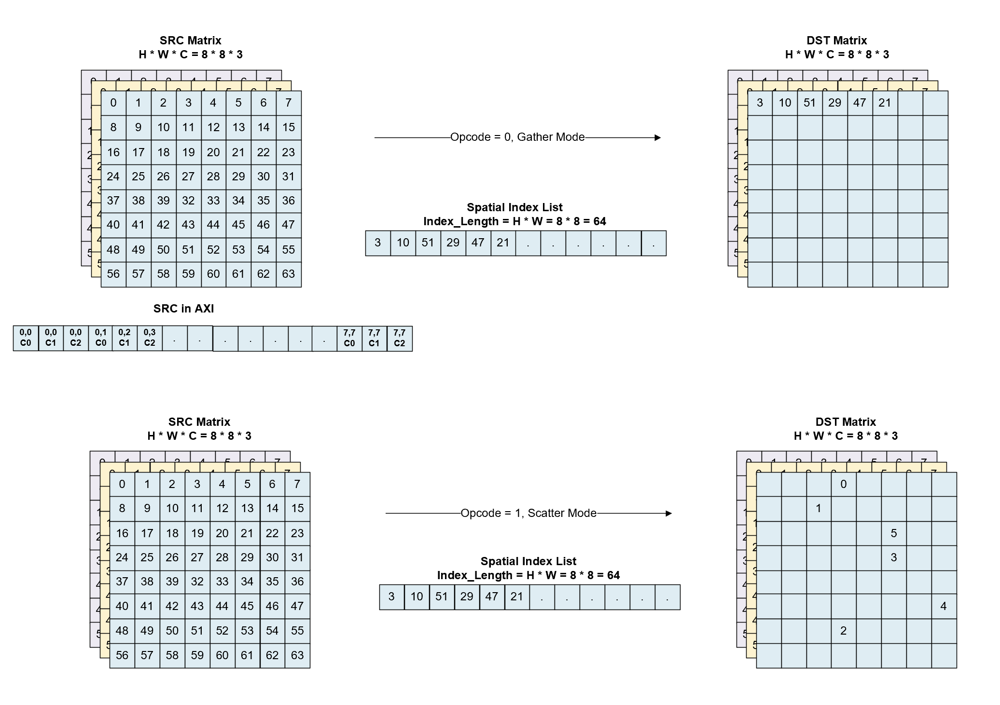

This diagram illustrates how the SGU performs gather and scatter operations using a spatial index list.

### SGU Hardware Architecture (4-stage pipeline)

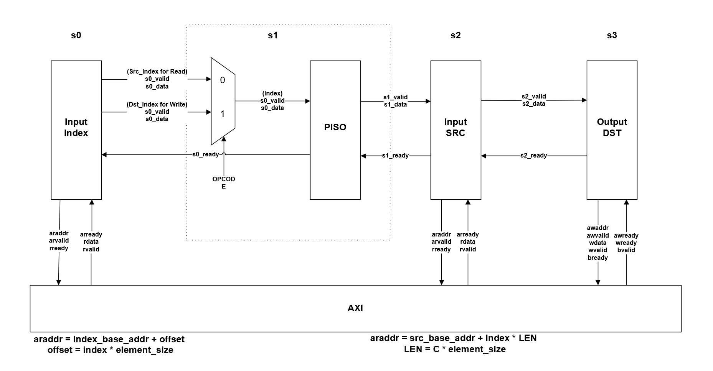

---

<h2 class="project-title">Diffusion AI Chip Tape-Out PCB (CPGA Socket Design)</h2>

**Duke University - CEI**  
Mar 2026 – Present (v1 completed Apr 2026)

Designed a 6-layer PCB socket system for a **164-pin diffusion AI chip** using a **CPGA-208 package**, enabling high-speed communication with dual USB FX3 boards and external debugging interfaces. Focused on **signal integrity, delay budgeting, and power domain partitioning** across chip-package-board co-design.

### PCB Schematic & Layout

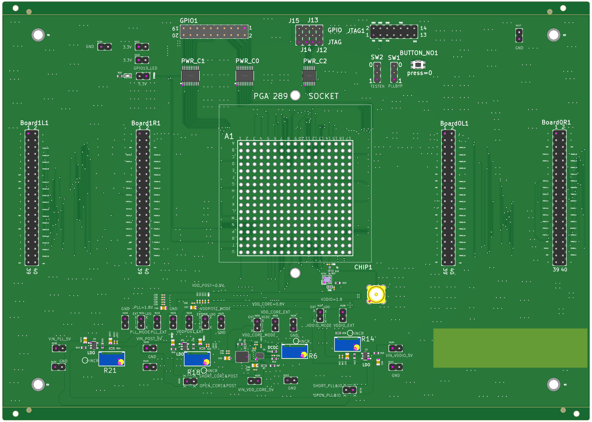

### Key Contributions

- Designed **CPGA-208 socket mapping and chip-to-board bonding interface** for a 164-pin custom ASIC
- Implemented **dual 32-bit high-speed interfaces (100 MHz)** to USB FX3 boards with strict timing constraints
- Achieved **length-matched routing (1800 mil ± 1 mil)** to ensure signal skew minimization
- Performed **end-to-end delay budgeting**: PCB delay (0.3ns) + USB interface (0.7ns) + Chip Package delay = **2.5 ~ 3 ns system requirement**
- Partitioned **multiple power domains (VDDIO / VDD_core / VDDHV / VDDPOST)** and designed stable power distribution network
- Completed **full schematic + BOM (JLCPCB components)** and **6-layer PCB layout** in Altium Designer

---

<h2 class="project-title">IEEE-754 Half Precision Floating-Point ALU</h2>

**Duke University**  
Sep 2025 – Dec 2025  

Designed a **16-bit floating-point ALU** supporting: ADD, SUB, MUL, DIV (Restoring Method)

Estimated performance (TSMC 65 nm):

- 16 MHz Maximum Frequency  
- <18 mW Power Consumption 
- 0.0083 mm² Divider Core Area

### Divider Core Top-Level Schematic

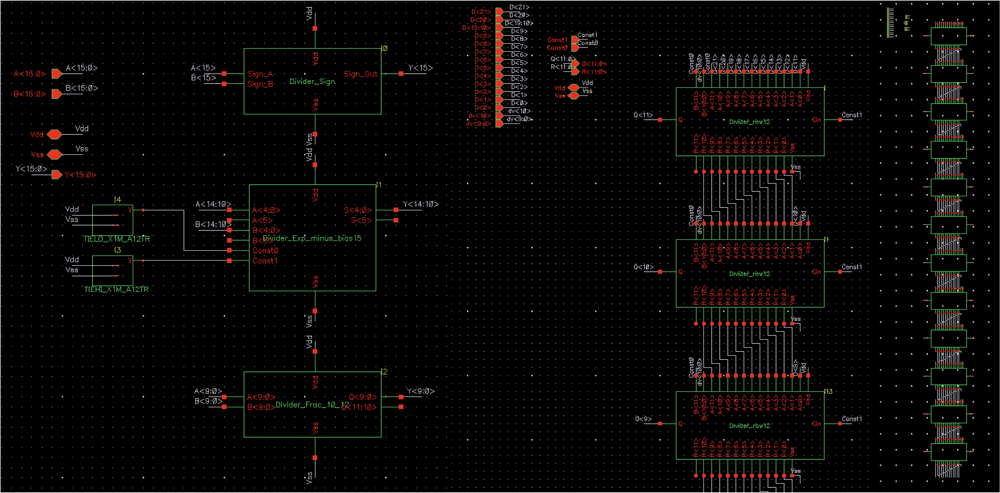

Top-level hierarchical schematic of the divider core showing sign processing, exponent logic, and fraction division datapath.

### Divider Core Layout

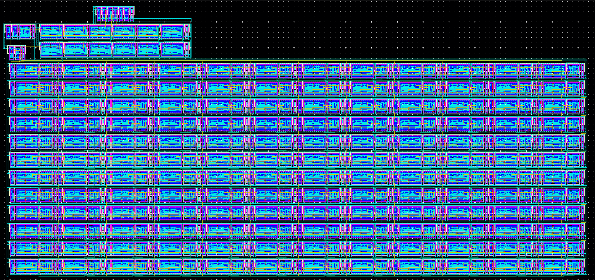

Standard-cell physical layout of the divider core implemented in a digital CMOS flow.

---

<h2 class="project-title">Multi-Channel FM Receiver with PLL-Based Tuning</h2>

**Duke University**  
Jan 2026 – Apr 2026  

Designed a **multi-channel FM receiver** in **65 nm CMOS** using PLL-based frequency tuning for RF downconversion. The receiver supports FM-band input selection and generates corresponding LO frequencies for a fixed IF architecture.

Key features:

- **RF input band:** 88–108 MHz, with selected input channels at **88 / 96 / 102 / 108 MHz**
- **LO generation:** 78 / 86 / 92 / 98 MHz for **10 MHz IF** downconversion
- **PLL reference clock:** 2 MHz
- **Supply voltage:** 1.2 V
- **Channel Selection & RF Generation (VCO) layout area:** approximately **0.687 mm²**

### Key Contributions

- Designed and verified the **multi-channel selection path**, including resistor-tree voltage generation and **4-to-1 MUX** channel selection.
- Implemented the **OTA buffer**, **ring VCO**, and PLL building blocks including **phase detector** and **charge pump** in Cadence Virtuoso.

### Problem & Solution

One major layout challenge was the large area caused by the **rppoly resistor-tree voltage divider**, which significantly increased the top-level layout area. A possible improvement is to replace the large rppoly resistor network with more area-efficient resistor options, such as **metal-to-metal resistor structures** or alternative compact passive implementations, to reduce area while maintaining stable channel-selection voltages.

### Receiver Architecture and Layout

Top-level schematic of the PLL-based multi-channel FM receiver, including channel selection, OTA buffer, VCO, phase detector, and charge pump blocks.

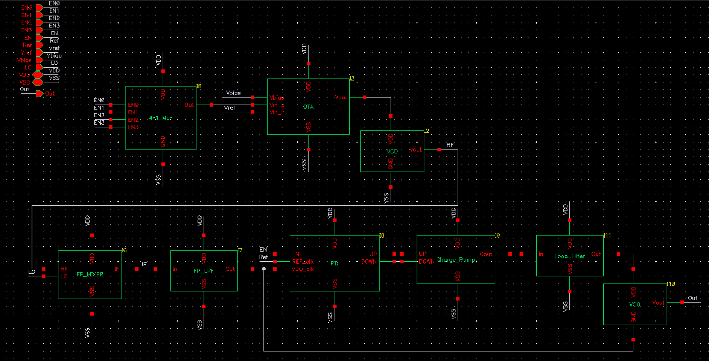

Layout of the channel selection and RF/LO generation section, including the resistor-tree voltage generation, 4-to-1 MUX, OTA buffer, and VCO tuning path.

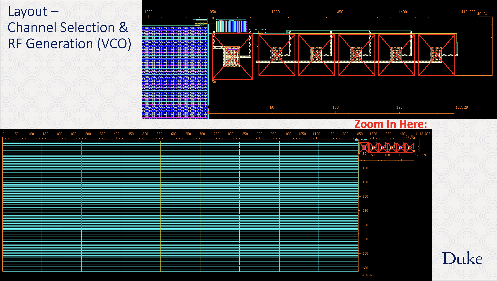

Layout of the PLL phase detector and charge pump blocks used for PLL-based frequency tuning.

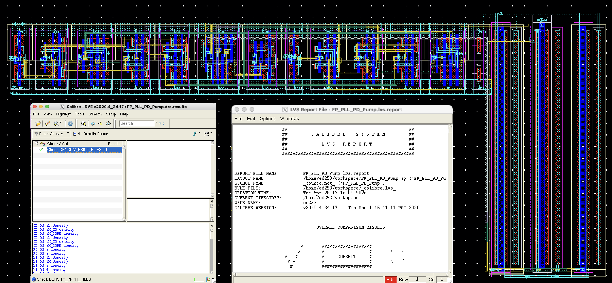

---

<h2 class="project-title">High-Frequency Power Electronics Converter</h2>

**University of Nottingham**  
Final Year Individual Project  
Oct 2024 – May 2025  

Designed and simulated a two-stage **7.4 kW / ~200 kHz** on-board charger (OBC) for **Electric Vehicles** using **SiC wide-bandgap** devices, modelled in PLECS/MATLAB with per-device thermal models.

Key results:

- **Totem-Pole PFC front-end** — power factor up to **0.98 (230 V)** / **0.9951 (110 V)**, efficiency **> 99%** across load (peak **99.13%**), current THD **0.21 (230 V) / 0.09 (110 V)**.
- **CLLC resonant DC–DC stage** — peak efficiency **99.9%**, holding **≥ 99.75% even at 20% light load**; closed-loop control cut total loss from **93.2 W → 26.6 W**.
- **Dual-loop PI + PR control** — output-voltage regulation within **±5%** (CLLC output within **±0.05%**) across **20%–100%** load and ±5% line variation.
- Evaluated **efficiency, loss distribution, and thermal behaviour** per SiC MOSFET/diode to confirm soft-switching and safe junction temperatures.

### System Architecture

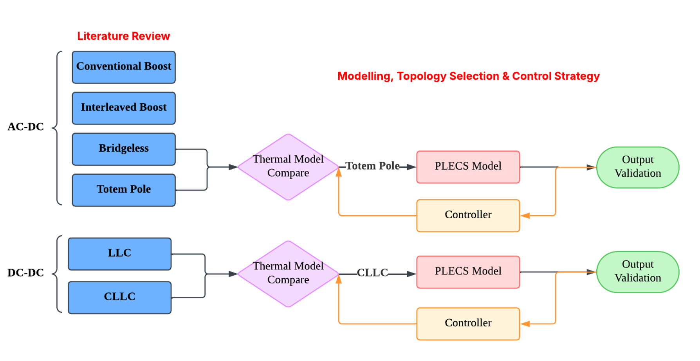

Two-stage architecture consisting of a Totem-Pole PFC front-end and a CLLC resonant DC–DC converter.

### PFC Stage

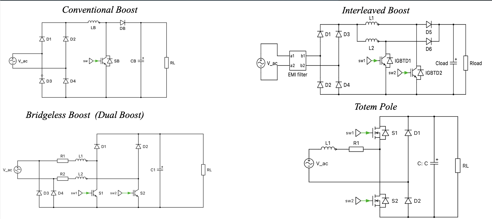

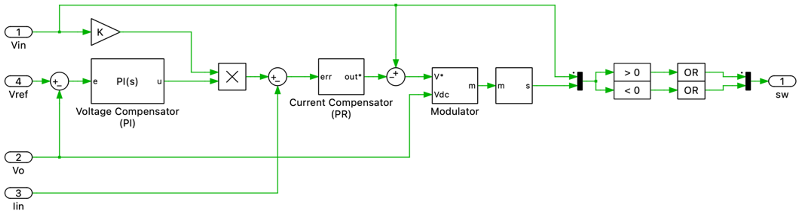

### DC-DC Converter Stage

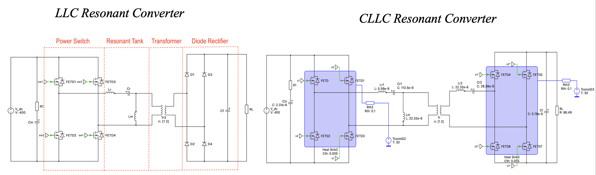

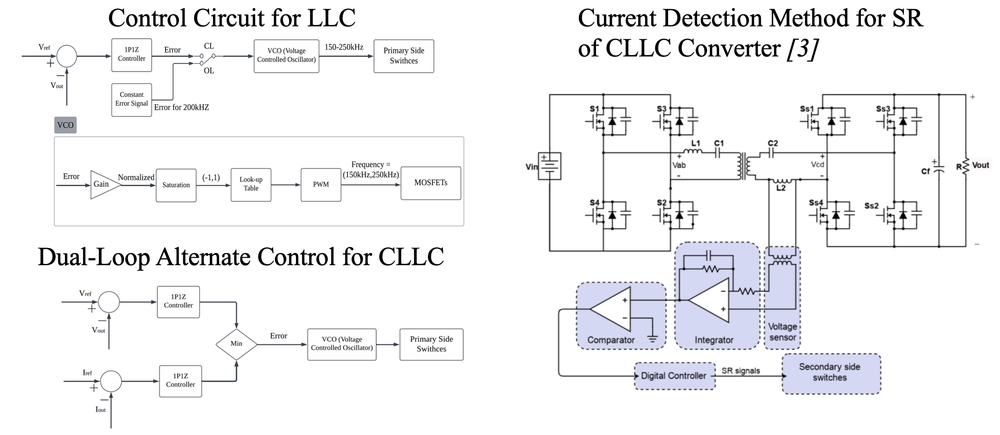

---

<h2 class="project-title">Omni-Directional Robot Collision Awareness</h2>

**University of Nottingham**  
Jun 2024 – Aug 2024  

Implemented an autonomous robot navigation system using **ROS and LiDAR-based SLAM**.

Key work:

- Configured **ROS Noetic + Gazebo + RViz** simulation environment
- Deployed **Cartographer SLAM** for real-time LiDAR mapping
- Integrated **RoboRTS navigation stack** for autonomous navigation
- Implemented **2D mapping and navigation** using LiDAR sensor data

### LiDAR Mapping Result (IAMET Building)

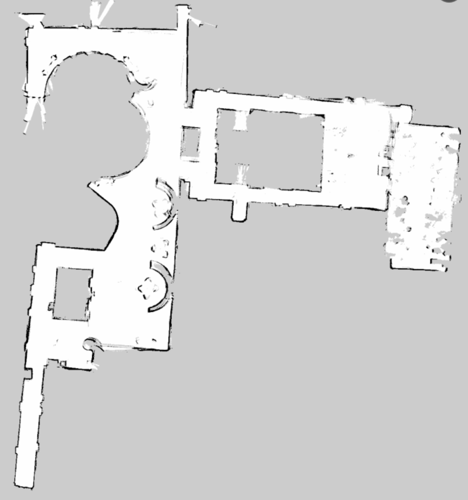

Final map generated by the Cartographer SLAM algorithm, reconstructing the layout of the second floor of the IAMET building using LiDAR data.

---

<h2 class="project-title">Heart Rate, Pulse Oximeter System</h2>

**University of Nottingham**  
Oct 2023 – Dec 2023  

Embedded biomedical device using **STM32**.

- Designed analog front-end circuits
- Implemented **FFT-based heart rate detection**
- Developed ADC firmware for signal processing

---

# 🎮 Have Fun(Game Demo)

<h2 class="project-title">Fire Emblem-Inspired SRPG Demo</h2>

**Personal Project**  
Apr 2026 – Present  

Developed a tactical role-playing game prototype in **Python** inspired by Fire Emblem-style grid combat. Implemented unit movement, attack range visualization, combat flow, terrain effects, chapter-based setup, and sprite-based rendering. Refactored the project for browser compatibility and deployed a playable web demo using **pygbag** and **GitHub Pages**.

### Highlights

- Built a grid-based SRPG framework with chapter selection, unit actions, AI turns, and terrain effects
- Implemented movement/attack range overlays, inventory actions, combat preview, and faction-based rendering
- Restructured the Python project entry flow for both local execution and browser runtime compatibility
- Debugged web runtime startup issues and deployed a playable online demo

Demo: [Play Project_Alpha](https://endong-dai.github.io/Project_Alpha/)

# 📬 Contact

Email  
ed253@duke.edu  
daiendong81@gmail.com  

GitHub  
https://github.com/endong-dai  

LinkedIn  
https://www.linkedin.com/in/endong-dai-607052385
